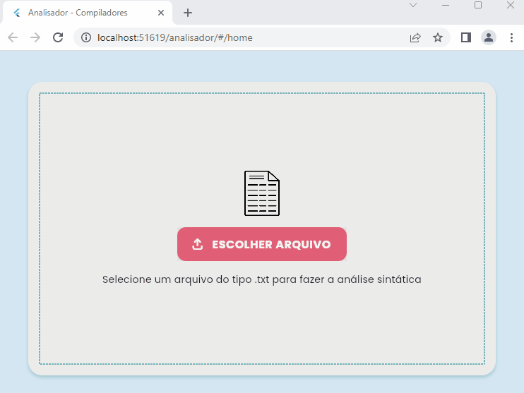

<h1 align="center"> Compiladores: Analisador Sintático 🔎 </h1>

## ℹ️ Sobre o projeto

Desenvolvimento de uma aplicação web que utiliza as tecnologias ANTLR, Flutter e Django Rest para realizar a análise sintática de texto relacionado a vagas de emprego em TI. A aplicação foi projetada para identificar elementos-chave, como nível de senioridade, tipo de vaga, salário, área (backend, frontend, fullstack, mobile), subáreas (frameworks), linguagens de programação e softskills exigidas.

## :sparkles: Funcionalidades do projeto

<p align="center">
  
</p>

## :hammer: Tecnologias usadas

Neste projeto foram usadas as seguintes tecnologias:

> Framework [Flutter](https://flutter.dev/)

> Linguagem [Dart](https://dart.dev/)

## :arrow_forward: Como executar

Primeiro você deve [instalar flutter](https://docs.flutter.dev/get-started/install).

Então, você pode clocar e entrar na pasta do projeto:

```bash
git clone https://github.com/jhoisz/analisador
cd analisador
```

Agora, para testar, você deve instalar os pacotes/dependêncas e usar um dispositivo conectado ao seu computador ou usar um emulador:

```bash
Flutter pub get
flutter run
```
